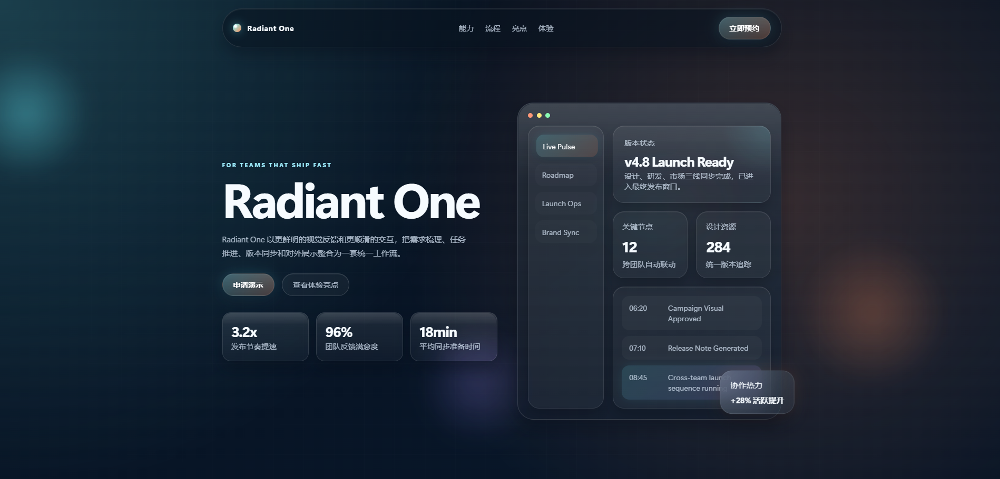
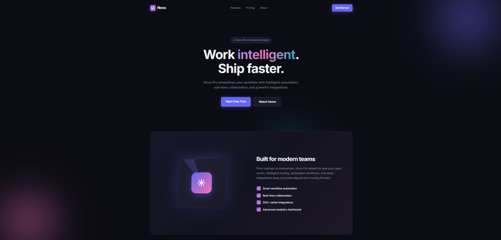
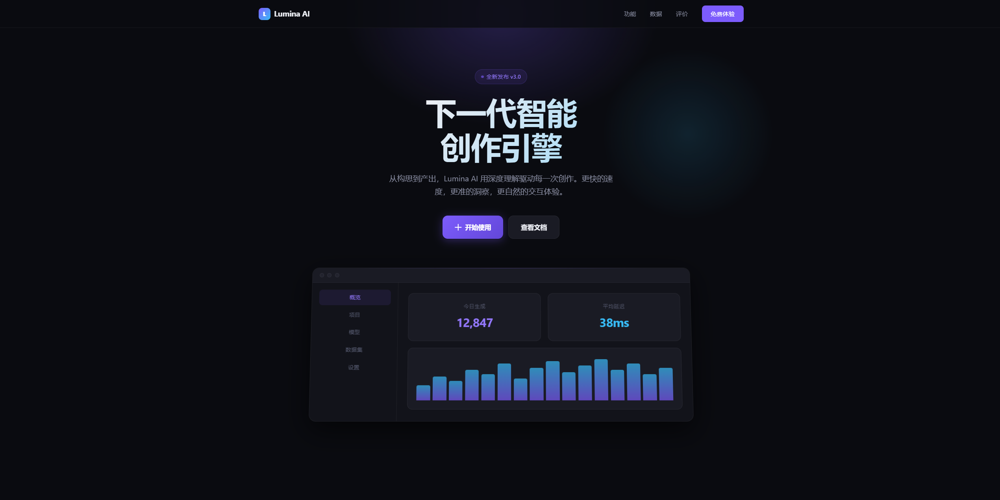
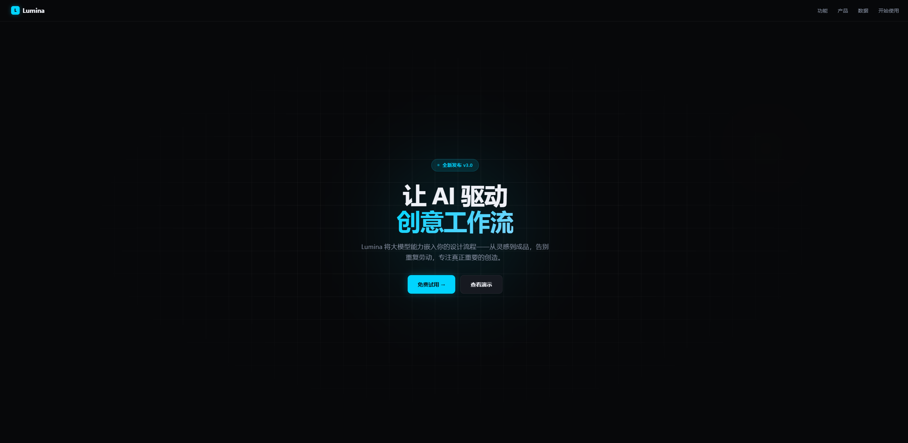

# UI Aesthetics

[English](./README.md) | 简体中文

[](https://github.com/kasonye/ui-aesthetics-skill)
[](https://linux.do/)
[](https://github.com/kasonye/ui-aesthetics-skill/releases/latest)
[](https://github.com/kasonye/ui-aesthetics-skill/stargazers)

面向多平台 AI 代理的 UI 审美增强技能包，用于生成、评审和重构更有视觉判断力的 Web UI。

`ui-aesthetics` 可以帮助代理在不盲目扩 scope、也不依赖“假高级感”堆料的前提下，产出更精致、更平衡、更准确、更接近产品级质感的界面。

## 项目概览

这个仓库维护了一份规范的 UI aesthetics 主技能，并把它适配到多个 agent 与 IDE 生态中。

- 规范源文件：`SKILL.md`
- 共享适配层：`.shared/ui-aesthetics/`
- 平台原生包装层：`.codex/`、`.claude/`、`.cursor/`、`.windsurf/`、`.opencode/`、`.gemini/`、`.qoder/`、`.kiro/`、`.github/`
- 深度参考资料：`references/`

如果你要更新技能内容，请优先修改 `SKILL.md`。

## 它能解决什么问题

当一个 UI 需要下面这些改进时，可以使用 `ui-aesthetics`：

- 更清晰的版式与层级
- 更紧致的间距、字体与信息密度
- 更精致的按钮、卡片、表单、表格与浮层
- 更平静的 hover、focus、selected、loading 与 error 状态
- 更克制、更准确的动效
- 更统一的阴影、模糊、高光和暗色深度逻辑

典型请求包括：

- “让这个 dashboard 更干净、更有高级感。”
- “解释一下这个页面为什么看起来像 AI 直接生成的。”
- “在不改变信息密度的前提下重构这个设置面板。”
- “收紧 hover、focus、selected、loading 和暗色深度表现。”

## 核心原则

- 保持用户要求的 scope
- 先修层级，再做装饰
- 克制优先于伪奢华
- 默认态要安静，语义态要清晰可分
- 动效和景深用于解释界面，而不是表演界面
- 结果要可交付、可维护

## 支持的平台

| 平台 | 仓库内入口 | 类型 |
| --- | --- | --- |
| Codex | `.codex/skills/ui-aesthetics/` + `agents/openai.yaml` | Skill |
| Claude Code | `.claude/skills/ui-aesthetics/` | Skill |
| OpenCode | `.opencode/skills/ui-aesthetics/` | Skill |
| OpenCode | `.opencode/commands/ui-aesthetics.md` | Command |
| Cursor | `.cursor/rules/ui-aesthetics.mdc` | Rule |
| Windsurf | `.windsurf/skills/ui-aesthetics/` | Skill |
| Windsurf | `.windsurf/workflows/ui-aesthetics.md` | Workflow |
| Gemini CLI | `.gemini/skills/ui-aesthetics/` | Skill |
| Qoder | `.qoder/skills/ui-aesthetics/` | Skill |
| Kiro | `.kiro/steering/ui-aesthetics.md` | Steering |
| GitHub Copilot | `.github/prompts/ui-aesthetics.prompt.md` | Prompt file |
| 通用共享别名 | `.agents/skills/ui-aesthetics/` | Skill alias |
| 兼容包装层 | `.agent/workflows/`、`.roo/commands/`、`.codebuddy/commands/` | Workflow / command |

## 安装

克隆这个仓库：

```bash
git clone https://github.com/kasonye/ui-aesthetics-skill.git
cd ui-aesthetics-skill
```

或者把它作为子模块引入到另一个仓库：

```bash
git submodule add https://github.com/kasonye/ui-aesthetics-skill.git .agent-skills/ui-aesthetics
```

克隆完成后，把你的平台指向本仓库中对应的入口即可。

常用入口：

- Codex：`.codex/skills/ui-aesthetics/`
- Claude Code：`.claude/skills/ui-aesthetics/`
- OpenCode：`.opencode/skills/ui-aesthetics/` 或 `.opencode/commands/ui-aesthetics.md`
- Cursor：`.cursor/rules/ui-aesthetics.mdc`
- Windsurf：`.windsurf/skills/ui-aesthetics/` 与 `.windsurf/workflows/ui-aesthetics.md`
- Gemini CLI：`.gemini/skills/ui-aesthetics/`
- Qoder：`.qoder/skills/ui-aesthetics/`
- Kiro：`.kiro/steering/ui-aesthetics.md`
- GitHub Copilot：`.github/prompts/ui-aesthetics.prompt.md`

## 使用方式

根据不同平台，`ui-aesthetics` 可以：

- 在任务明显属于 UI polish 时被自动选中
- 作为 skill、rule、workflow、command 或 prompt 被显式调用

常见调用方式：

- `$ui-aesthetics`
- `/ui-aesthetics`
- `@ui-aesthetics`
- 在 GitHub Copilot 中选择 prompt file

## 示例提示词与输出

示例中使用的提示词：

> 用仓库里的 skill 写一个产品介绍页，配色要亮眼能吸引人，要有一点动效和光效，并保留一定立体感。

<table>
  <tr>
    <td width="50%" align="center">
      <strong>由 Codex + GPT-5.4 生成</strong>
      <br />
      
    </td>
    <td width="50%" align="center">
      <strong>由 Claude Code + MiniMax M2.7 生成</strong>
      <br />
      
    </td>
  </tr>
</table>
<table>
  <tr>
    <td width="50%" align="center">
      <strong>由 Claude Code + Claude Opus 4.6 生成</strong>
      <br />
      
    </td>
    <td width="50%" align="center">
      <strong>由 Claude Code + GLM-5.1 生成</strong>
      <br />
      
    </td>
  </tr>
</table>

这四张展示图大致体现了这个 skill 在营销型产品页里倾向鼓励的视觉方向：更明亮的配色、更有控制感的光感、更轻微但有节奏的动势，以及更分层的空间深度。

## Skill 路线

这个 skill 主要围绕六种工作模式进行优化：

1. Generation
2. Review
3. Refactor
4. Component Polish
5. State / Motion Refinement
6. Depth / Lighting Refinement

## 平台行为

_最后一次基于公开文档与参考仓库核对：2026 年 4 月 11 日。_

| 平台 | 使用入口 | 调用 / 行为 |
| --- | --- | --- |
| Codex | `.codex/skills/ui-aesthetics/` + `agents/openai.yaml` | 相关任务时自动选择，或通过客户端 skill UX 显式调用，常见形式如 `$ui-aesthetics ...` |
| Claude Code | `.claude/skills/ui-aesthetics/` | 相关任务时自动选择，或通过 `/ui-aesthetics ...` 显式调用 |
| OpenCode | `.opencode/skills/ui-aesthetics/` | 相关任务时自动选择 |
| OpenCode command | `.opencode/commands/ui-aesthetics.md` | 显式 `/ui-aesthetics` 命令 |
| Cursor | `.cursor/rules/ui-aesthetics.mdc` | Agent Requested rule，或显式 `@ui-aesthetics` |
| Windsurf | `.windsurf/skills/ui-aesthetics/` | 自动 skill 或 `@ui-aesthetics` |
| Windsurf workflow | `.windsurf/workflows/ui-aesthetics.md` | 显式 `/ui-aesthetics` workflow |
| Gemini CLI | `.gemini/skills/ui-aesthetics/` | 自动选择 skill；也可通过 `/skills` 或 `gemini skills ...` 管理 |
| Qoder | `.qoder/skills/ui-aesthetics/` | 自动 skill 或 `/ui-aesthetics` |
| Kiro | `.kiro/steering/ui-aesthetics.md` | 自动 steering 与 `/ui-aesthetics` |
| GitHub Copilot | `.github/prompts/ui-aesthetics.prompt.md` | 在 prompt-file picker 中选择 |
| 通用别名 | `.agents/skills/ui-aesthetics/` | 适用于支持共享 `.agents/skills/` 发现机制的工具 |
| 兼容包装层 | `.agent/workflows/`、`.roo/commands/`、`.codebuddy/commands/` | 尽力与参考仓库保持对齐的 command / workflow 入口 |

## 仓库结构

```text
.
|- SKILL.md
|- README.md
|- README.zh-CN.md
|- .shared/ui-aesthetics/
|- references/
|- .codex/skills/ui-aesthetics/
|- .claude/skills/ui-aesthetics/
|- .cursor/rules/
|- .windsurf/skills/
|- .windsurf/workflows/
|- .opencode/
|- .gemini/
|- .qoder/
|- .kiro/
`- .github/prompts/
```

## 维护说明

推荐的更新流程：

1. 先编辑 `SKILL.md`
2. 如果精简版指导发生变化，再同步刷新 `.shared/ui-aesthetics/`
3. 仅在适配格式或调用行为变化时更新各平台包装层
4. 当安装方式、支持平台或使用预期变化时，同时更新 `README.md` 和 `README.zh-CN.md`
